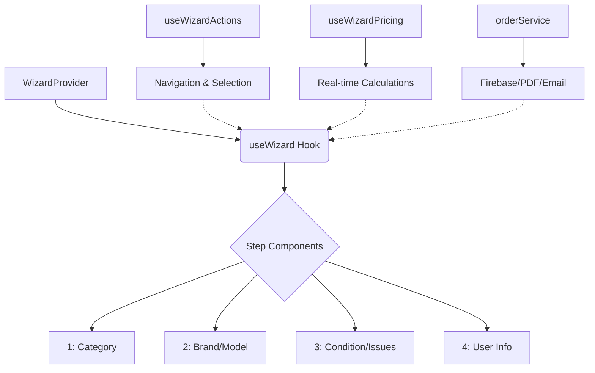

# Belmobile OS - AI System Memory

This document serves as the "Source of Truth" to prevent context drift during long development sessions. Reference this file to understand the architecture, goals, and constraints of the Belmobile platform.

## 🎯 High-Level Project Goals
1.  **Premium UX**: A "SaaS-like" professional interface for device buyback and repair.
2.  **Financial Integrity**: Real-time accurate pricing estimates based on dynamic Firestore data.
3.  **Universal Accessibility**: Multi-language support (EN/FR/NL) with SEO optimization for Brussels hubs.
4.  **Zero-Regression Architecture**: Modular code using context and hooks to isolate logic from UI.

## 🛠️ Tech Stack Versions
- **Core**: Next.js 16.1.0 (Turbopack Enabled), React 19.2.1
- **Styling**: Tailwind CSS 4.0
- **Database/Auth**: Firebase SDK 12.6.0
- **AI**: Gemini 2.0 Flash (`@google/generative-ai`)
- **Animations**: Framer Motion 12.23
- **PDF**: jsPDF 3.0 (Custom high-fidelity templates)

## 🏗️ Core Architecture

### Wizard Orchestration (Decentralized)
The Wizard components follow a strict unidirectional data flow:

### Key Principles
- **Logic Isolation**: All pricing math is in `useWizardPricing.ts`. All side effects are in `orderService.ts`.
- **State Sovereignty**: Step components do NOT accept props for state; they consume `useWizard()`.
- **Deployment Safety**: 
    - Vercel = Frontend.
    - Firebase = Data/Rules/Storage.
    - `proxy.ts` = The only gatekeeper (middleware is legacy).

## 🚀 Critical Refactors (Context)
- **Dec 2025**: refactored `BuybackRepair.tsx` from 1300+ lines to ~200 lines. Transitioned from prop-drilling to `WizardContext`.
- **Dec 2025**: Optimized PDF generator for 1-page A4 fit (Inksaver mode).
- **Dec 2025**: Completed Phase Y (Full localization for NL/FR, Google image handling fix).

## 🚀 Future Roadmap: Phase Z (Growth & Operational Excellence)
- **Lead Recovery**: Automated "Magic Link" flows via Firestore + Brevo for abandoned quotes.
- **Service Reviews**: Automated review requests scheduling 3 days post-completion.
- **Reporting v2**: Category-level analytics (Smartphone/Tablet/Console) and Conversion Rate tracking.
- **Lead Management**: Admin interface for manual lead inspection and re-engagement.

## 📂 Search & Data Pathing
- **Brands/Models**: `src/data/brands.ts` & `src/data/deviceImages.ts`.
- **Pricing**: Dynamic lookup from Firestore `pricing` collection via `usePublicPricing`.
- **Search Index**: Built via `scripts/build-search-index.mjs`, consumed by Gemini and Wizard search.

## ⚠️ Known Constraints
- **GDPR Compliance**: Leads must have an `expiresAt` field (currently set to 30 days).
- **ESLint 9**: Local `npm run lint` is inconsistent on Windows. Trust `npm run build` instead.

## 🛡️ Admin Dashboard v1.1 (In Development)
- **Atomic Updates**: `DataContext` supports generic `updateQuoteFields`.
- **Audit Logging**: All price/status changes are logged with timestamp and admin ID.
- **PDF Generation**: Admins can regenerate/download official PDF orders on demand.
- **Internal Notes**: Private text area for staff collaboration per order.

## 🌍 Environment
- **Production URL**: https://belmobile-next-st7t42wyo-tovrrs-projects.vercel.app
- **Staging / Preview**: Vercel Preview Deployments via PRs

