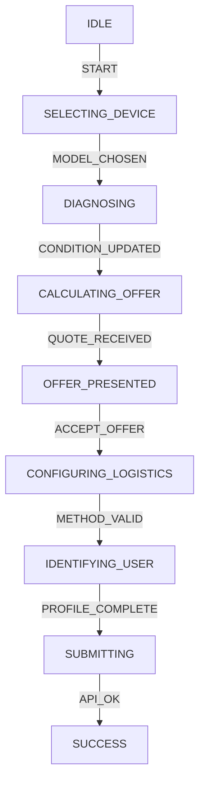

# Multi-Agent State Machine Architecture for "Wizard"

## 1. Executive Summary

The current "Wizard" component operates as a linear sequence of steps. While functional, this monolithic approach limits scalability, complicates state management (especially with async pricing), and makes adding new flows (e.g., B2B bulk trade-in) difficult.

This document proposes refactoring the Wizard into a **Multi-Agent State Machine (MASM)**. In this architecture, autonomous "Agents" manage specific domains of the transaction (Selection, Diagnostics, Pricing, Logistics, Identity). A central **State Machine Controller** orchestrates the high-level flow, treating these Agents as state nodes.

### Key Benefits
- **Decoupled Logic**: Pricing logic is isolated from UI rendering.
- **Asynchronous Reliability**: Pricing checks happen in the background without blocking the UI.
- **Scalability**: New flows (e.g., "Trade-in" vs "Buyback") are just different paths through the same graph.
- **Testability**: Each Agent can be unit-tested independently.

---

## 2. The Agent Ecosystem

We define 5 core Agents, each responsible for a specific slice of the transaction state.

### 2.1 The **SelectionAgent**
*   **Responsibility**: Validates *what* is being processed.
*   **State Slice**: `deviceType`, `brand`, `model`, `capacity`.
*   **Actions**:
    *   `SELECT_DEVICE(type)`
    *   `SELECT_BRAND(brandId)`
    *   `SELECT_MODEL(modelId)`
*   **Rules**:
    *   Cannot proceed to Diagnostics until a valid specific Model variant is confirmed.

### 2.2 The **DiagnosticAgent**
*   **Responsibility**: Determines the *condition* of the item.
*   **State Slice**: `issues[]`, `condition` (grade), `functional_tests[]`.
*   **Actions**:
    *   `ADD_ISSUE(issueId)`
    *   `REMOVE_ISSUE(issueId)`
    *   `SET_COSMETIC_GRADE(grade)`
*   **Rules**:
    *   Output is a "Condition Hash" used by the PricingAgent.

### 2.3 The **PricingAgent** (The Brain)
*   **Responsibility**: Calculates the *financial* outcome based on inputs from Selection and Diagnostic agents.
*   **State Slice**: `quoteId`, `estimatedValue`, `currency`, `priceLockExpiration`.
*   **Actions**:
    *   `CALCULATE_QUOTE(model, condition)` -> *Async*
    *   `REFRESH_QUOTE()` -> *Async*
*   **Behavior**:
    *   Listens to changes in Selection or Diagnostic state.
    *   Debounces inputs to prevent API spam.
    *   Manages "Price Lock" timers.

### 2.4 The **LogisticsAgent**
*   **Responsibility**: Manages *how* the exchange happens.
*   **State Slice**: `deliveryMethod` (dropoff/mail/courier), `courierSlot`, `servicePointId`.
*   **Actions**:
    *   `SET_METHOD(method)`
    *   `SELECT_SLOT(dateTime)`
    *   `VALIDATE_ADDRESS(address)`
*   **Rules**:
    *   Ensures selected method is available for the user's location.

### 2.5 The **UserAgent**
*   **Responsibility**: Manages *who* is performing the transaction.
*   **State Slice**: `contactDetails`, `gdprConsent`, `companyDetails` (if B2B).
*   **Actions**:
    *   `UPDATE_PROFILE(details)`
    *   `VERIFY_PHONE(otp)` -> *Async*

---

## 3. The State Graph (Controller)

The core `WizardContext` is replaced by `MachineContext`. The machine defines the valid transitions between these high-level states.

### State Node Definition
```typescript
type WizardState = 
  | 'IDLE'
  | 'SELECTING_DEVICE'
  | 'DIAGNOSING'
  | 'CALCULATING_OFFER' // Transient state
  | 'OFFER_PRESENTED'
  | 'CONFIGURING_LOGISTICS'
  | 'IDENTIFYING_USER'
  | 'SUBMITTING'
  | 'SUCCESS'
  | 'FAILURE';
```

### Transition Flow (Buyback)


---

## 4. Implementation Strategy

### Phase 1: Context Refactoring
Split the massive `WizardContext` into smaller hooks that will eventually become the Agents.
*   Create `useSelection()`
*   Create `useDiagnostics()`
*   Create `usePricing()`

### Phase 2: React Component Composition
Refactor the Wizard component to use a "Slot" pattern where the current `activeState` determines which Component (Agent View) is rendered.

```tsx
// WizardMachine.tsx (Pseudo-code)
export const WizardMachine = () => {
  const { state, context } = useMachine(buybackMachine);

  switch (state.value) {
    case 'SELECTING_DEVICE':
      return <SelectionView agent={context.selectionAgent} />;
    case 'DIAGNOSING':
      return <DiagnosticView agent={context.diagnosticAgent} />;
    case 'OFFER_PRESENTED':
      return <OfferView pricing={context.pricingAgent} />;
    // ...
  }
}
```

### Phase 3: XState Integration (Recommended)
Adopt **XState** for the state machine logic.
*   Define the machine in `src/machines/buybackMachine.ts`.
*   Services (Async calls) are defined as machine services (e.g., `services: { calculatePrice: ... }`).

### Phase 4: Parallel States
Enable advanced features:
*   **Parallel Pricing**: While the user is entering their address (Logistics), the PricingAgent can be re-validating the quote in the background to ensure it hasn't expired.

---

## 5. Directory Structure Proposal

```
src/
  machines/
    buybackMachine.ts      # The definition of the state graph
    repairMachine.ts       # A variant graph for simple repairs
  agents/
    SelectionAgent.ts      # Logic for device selection
    PricingAgent.ts        # Logic for calling pricing API
    LogisticsAgent.ts      # Logic for SendCloud/Bpost integration
  components/
    wizard/
      views/               # The UI representations of states
        SelectionView.tsx
        DiagnosticView.tsx
      WizardMachine.tsx    # The main container
```

## 6. Next Steps
1.  **Refactor**: Begin by extracting `usePricing` logic from `StepCategorySelection` and `StepUserInfo`.
2.  **Define**: Write the TypeScript interface for the `MachineContext`.
3.  **Prototype**: Create the `WizardMachine` shell and implement the 'Selection' state first.
